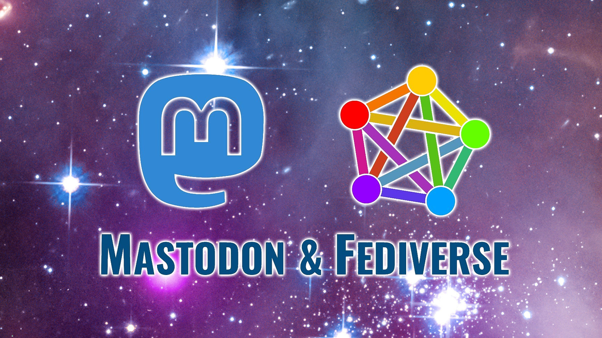

# Mastodon

Mastodon is free and open-source software for running self-hosted social networking services. It has microblogging features similar to the Twitter service, which are offered by a large number of independently run nodes, known as instances, each with its own code of conduct, terms of service, privacy options, and moderation policies.

## Guide to Mastodon

Noëlle Anthony has compiled and excellent [Guide to Mastodon](GuideToMastodon/README.md), included here as it is [freely licensed](GuideToMastodon/LICENSE.md).

## Overview

Each user is a member of a specific Mastodon instance (also called a server), which can interoperate as a federated social network, allowing users on different instance to interact with each other. This is intended to give users the flexibility to select a node whose policies they prefer, but keep access to a larger social network. Mastodon is also part of the Fediverse ensemble of server platforms, which use shared protocols allowing users to also interact with users on other compatible platforms, such as PeerTube and Friendica.

The Mastodon mascot is an animal with a trunk, resembling a mastodon or mammoth, sometimes depicted using a tablet or smartphone. Messages posted using the software are called "toots". Mastodon was created by Eugen Rochko and announced on Hacker News in October 2016.

## Functionality and features

Mastodon servers run social networking software that is capable of communicating using W3C's ActivityPub standard, which has been implemented since version 1.6. A Mastodon user can therefore interact with users on any other server in the Fediverse that supports ActivityPub.

Since version 2.9.0 Mastodon has offered a single column mode for new users by default. In advanced mode Mastodon approximates the microblogging user experience of TweetDeck. Users post short-form status messages for others to see. On a standard Mastodon instance, these messages can include up to 500 text-based characters, an extension of Twitter's 280 character limit, although numerous Mastodon servers have forked the source code to allow a larger character limit. Posts are called "toots" instead of Twitter's "tweets".

Users join a specific Mastodon server, rather than a single website or application. The servers are connected as nodes in a network, and each server can administrate its own rules, account privileges, and whether to share messages to and from other servers. Many servers have a theme based on a specific interest. It is also common for servers to be based around a particular locality, region, or country.

Mastodon includes a number of specific privacy features. Each message has a variety of privacy options available, and users can choose whether the message is public or private. Public messages display on a global feed, known as a timeline, and private messages are only shared on the timelines of the user's followers. Messages can also be marked as unlisted from timelines or direct between users. Users can also mark their accounts as completely private. In the timeline, messages can display with an optional "content warning" feature, which requires readers to click on the content to reveal the rest of the message. Mastodon servers have used this feature to hide spoilers, trigger warnings, and not safe for work (NSFW) content, though some accounts use the feature to hide links and thoughts others might not want to read.

Mastodon aggregates messages in local and federated timelines in real-time. The local timeline shows messages from users on a singular server, while the federated timeline shows messages across all participating Mastodon servers. Users can communicate across connected Mastodon servers with usernames similar in format to full email addresses.

In early 2017, journalists like Sarah Jeong distinguished Mastodon from Twitter for its approach to combating harassment. Mastodon uses community-based moderation, in which each server can limit, or filter out undesirable types of content. For example, mastodon.social and several other servers ban content that is illegal in Germany or France, including Nazi symbolism, Holocaust denial, and incitement of violence against Jews. Servers can also choose to limit, or filter out messages with disparaging content. Mastodon's founder Eugen Rochko (born in Russia and based in Jena, Germany) believes that small, closely related communities deal with unwanted behaviour more effectively than a large company's small safety team. Users can also block and report others to administrators, much like on Twitter.

## Resources

- [Mastodon website](https://joinmastodon.org)
- [Repository](https://github.com/mastodon/mastodon)
- [Blog](https://blog.joinmastodon.org)
- [Browse Mastodon servers](https://joinmastodon.org/communities)
- [Browse Mastodon apps](https://joinmastodon.org/apps)
- [Comparison of microblogging services](https://en.wikipedia.org/wiki/Comparison_of_microblogging_services)
- [The Fediverse](https://en.wikipedia.org/wiki/Fediverse)

## See also

- [Tuir](tuir/tuir.md)
- [Irssi](irssi.md)
- [NeoMutt](neomutt.md)
- [Newsboat](newsboat.md)
