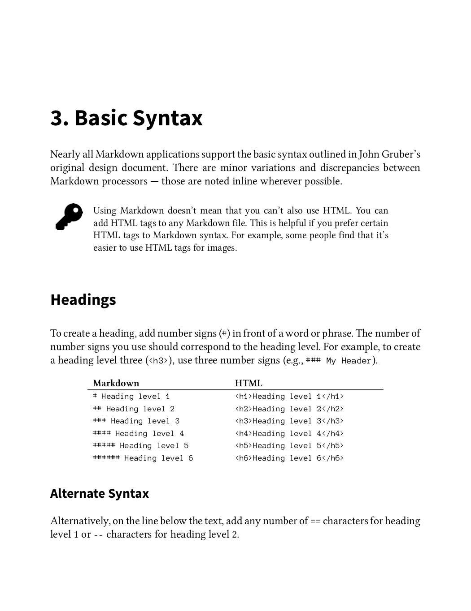
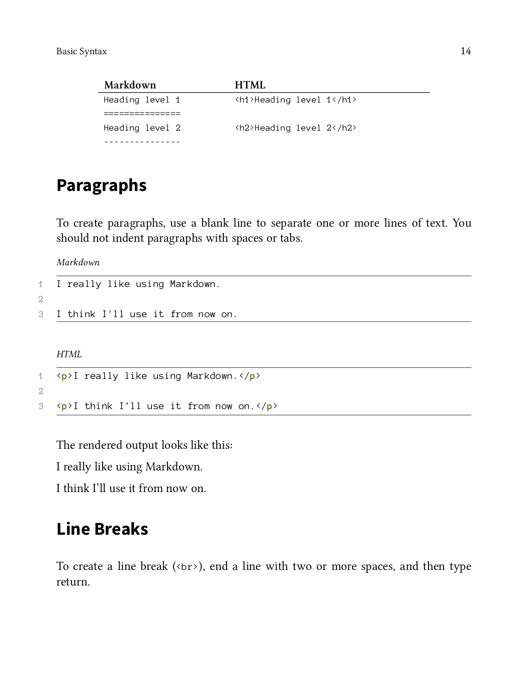

# The Markdown Guide

By Matt Cone

Learn Markdown in 60 pages. *The Markdown Guide* book includes everything you need to get started and master Markdown syntax.

- Professional quality PDF and EPUB files (DRM-free)
- Unlimited free lifetime updates
- 100% satisfaction guaranteed

[Buy now for $5](https://mattcone.gumroad.com/l/markdownguide)
        

*The Markdown Guide* is also available on [Leanpub](https://leanpub.com/themarkdownguide) and [Amazon](https://amzn.to/31FMLMA)

Read by professionals working at:

|           |            |             |
|-----------|------------|-------------|
|  |  |  |
|  |  |  |

## Take your Markdown skills to the next level

Master the power of Markdown and take full control of the syntax.

- Learn how Markdown works and dive in using an online editor
- Practice using basic and extended Markdown syntax elements
- Start using Markdown everywhere  for all of your writing

## What's inside

Detailed descriptions. Clear and concise examples. Beautifully formatted pages.

        

## Trusted by thousands of readers

- 5 stars on [Gumroad](https://mattcone.gumroad.com/l/markdownguide)
- 4 stars on [Amazon](https://amzn.to/31FMLMA)
- 4 stars on [Goodreads](https://www.goodreads.com/book/show/41831817-the-markdown-guide)

    > *The Markdown Guide* is hands-down the best Markdown reference.
    >
    > Michael Hartl, Founder of [Learn Enough](https://www.learnenough.com/) and author of the [Ruby on Rails Tutorial](https://www.railstutorial.org/)

    > If you're looking for an in-depth guide for more Markdown tips and tricks, I highly recommend the unofficial but authoritative *Markdown Guide*
    >
    > Justin Duke, Engineering Manager at [Stripe](https://stripe.com/) and Founder of [Buttondown](https://buttondown.email/)

    > *The Markdown Guide* is awesome. I keep it open in a browser tab for reference while working on my guides.
    >
    > Rob Reeder, Documentation Specialist, [Software Engineering Institute, CMU](https://cert.org)

    > If you’re working with Markdown, then do yourself a favour and check out *The Markdown Guide*... It’s excellent.
    >
    > Matthew Setter, via [Twitter](https://twitter.com/settermjd/status/1126099562345705472)

    > A terrific reference—straightforward and well organized, briskly paced, and featuring a spot-on instructive tone that conveys friendly engagement.
    >
    > David Buck, Technical Writer

    > This book provides the right amount of information to learn Markdown and I highly recommend it!
    >
    > Mohamad Kalaaji, via [Goodreads](https://www.goodreads.com/review/show/3419254608)

    > I've found this very simple guide to Markdown syntax very useful in a pinch.
    >
    > Morgan Thompson, via [Twitter](https://twitter.com/datamorgan/status/1109518506125451264)

    > Well done! This is an incredibly valuable and well-done resource. It does a great job of educating without becoming too overwhelming or too narrowly focused on one application of Markdown.
    >
    > nxprefect, via [Reddit](https://www.reddit.com/r/Markdown/comments/8gi8yb/i_created_an_open_source_markdown_guide/dycxpvb/)

## 100% satisfaction guaranteed

If you're not completely satisfied with *The Markdown Guide*, I'll refund your money, no questions asked.

[Buy now for $5](https://mattcone.gumroad.com/l/markdownguide)

### About the Author

Matt Cone is a technical writer at [Fastly](https://www.fastly.com). He has experience creating documentation for organizations like Linode and the U.S. Department of Health and Human Services. Matt's first book, *[Master Your Mac](https://www.amazon.com/Master-Your-Mac-Simple-Customize/dp/1593274068/)*, was published by No Starch Press. To get in touch with Matt, visit [https://www.mattcone.com](https://www.mattcone.com).

