# Markdown tools

Collected here is an extensive set of descriptions of Markdown tools. Click the name of the tool to view a markdown document describing it briefly along with a link to its home.

|    |    |    |    |
|----|----|----|----|
| [Airsend](airsend.md) | [Batnoter](tools/batnoter.md) | [Bear](tools/bear.md) | [Boostnote](tools/boostnote.md) |
| [Byword](tools/byword.md) | [Carrd](tools/carrd.md) | [Codimd](tools/codimd.md) | 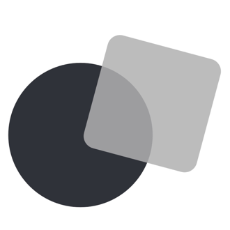[Collected-notes](tools/collected-notes.md) |
| [Dawin](tools/dawin.md) | [Deepdwn](tools/deepdwn.md) | 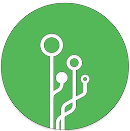[Dendron](tools/dendron.md) | [Dillinger](tools/dillinger.md) |
| [Discord](tools/discord.md) | [Docsify](tools/docsify.md) | 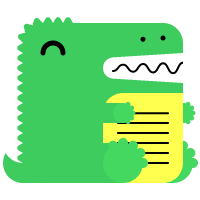[Docusaurus](tools/docusaurus.md) | [Dpaste](tools/dpaste.md) |
| [Fsnotes](tools/fsnotes.md) | 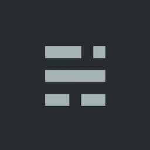[Ghost](tools/ghost.md) | [Gitbook](tools/gitbook.md) | 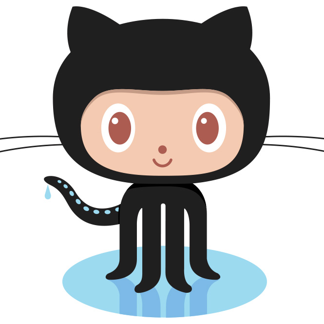[Github-pages](tools/github-pages.md) |
| 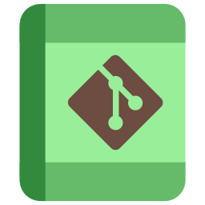[Gitjournal](tools/gitjournal.md) | [Google-docs-to-markdown](tools/google-docs-to-markdown.md) | [Hackmd](tools/hackmd.md) | [Hedgedoc](tools/hedgedoc.md) |
| [Hugo](tools/hugo.md) | 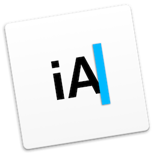[IA-writer](tools/ia-writer.md) | 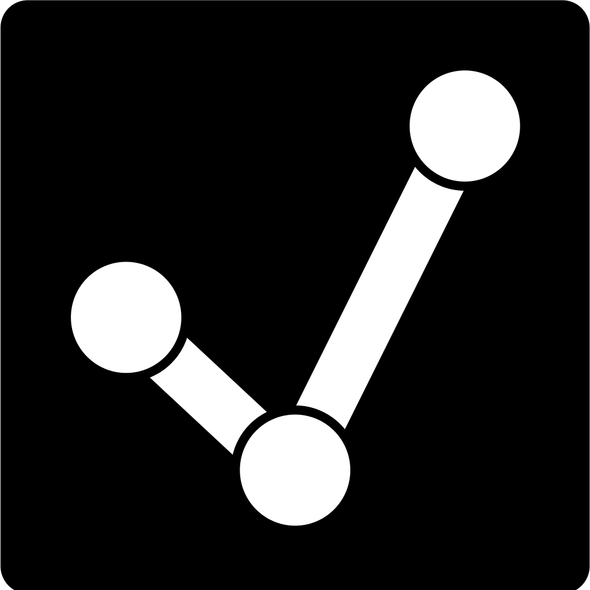[Imdone](tools/imdone.md) | [Inkdrop](tools/inkdrop.md) |
| 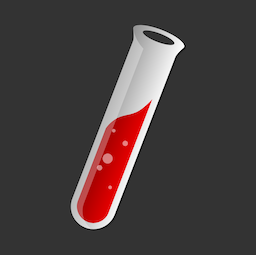[Jekyll](tools/jekyll.md) | [Joplin](tools/joplin.md) | 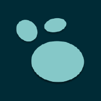[Logseq](tools/logseq.md) | [Macdown](tools/macdown.md) |
| [Madoko](tools/madoko.md) | [Mark-text](tools/mark-text.md) | [Markdeep](tools/markdeep.md) | [Markdown-here](tools/markdown-here.md) |
| [Markdown-tool](tools/markdown-tool.md) | [Marked-2](tools/marked-2.md) | [Mattermost](tools/mattermost.md) | [Mkdocs](tools/mkdocs.md) |
| [Notable](tools/notable.md) | [Notenik](tools/notenik.md) | [Noteshub](tools/noteshub.md) | [Notion](tools/notion.md) |
| 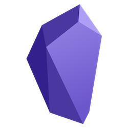[Obsidian](tools/obsidian.md) | [Outline](tools/outline.md) | [Reddit](tools/reddit.md) | [Resumey-pro](tools/resumey-pro.md) |
| [Simpleen](tools/simpleen.md) | [Simplenote](tools/simplenote.md) | [Slack](tools/slack.md) | [Squarespace](tools/squarespace.md) |
| [Stackedit](tools/stackedit.md) | [Standard-notes](tools/standard-notes.md) | [Supernotes](tools/supernotes.md) | [Things](tools/things.md) |
| [Todoist](tools/todoist.md) | [Trello](tools/trello.md) | [Typora](tools/typora.md) | [Ulysses](tools/ulysses.md) |
| [Vscode](tools/vscode.md) | [Wiki-js](tools/wiki-js.md) | [Zettlr](tools/zettlr.md) | [Znote](tools/znote.md) |
