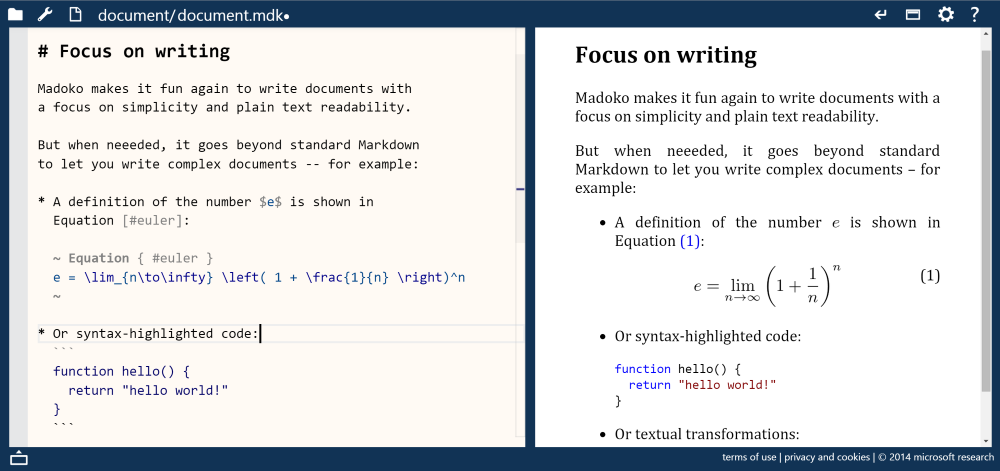

[Madoko](https://www.madoko.net/) is a fast Markdown processor for writing professional articles, books, manuals, webpages and presentations, with a focus on simplicity and plain text readability. You can use Madoko to write complex documents in Markdown and get beautiful PDF and HTML output. Madoko is a Javascript Markdown processor written in Koka. It started out as a demo program for the new, strongly typed, Koka language and the name comes from "Markdown in Koka."

Madoko can both be run locally as a command-line program or on Madoko.net to take advantage of storage and collaboration features. Madoko integrates seamlessly with Dropbox, Github, and OneDrive. It automatically synchronizes all changes in the cloud. This way, your document is always available from any device. The online editor can also edit files on the local disk, or run LaTeX locally, using the Madoko local program.

Madoko implements extensions like Github Flavored Markdown, [pandoc](https://pandoc.org/), [Markdown Extra](https://michelf.ca/projects/php-markdown/extra/), and [multi-markdown](https://fletcherpenney.net/multimarkdown/), and it adds other useful features for writing academic and industrial documents.

In Madoko, tabs are considered to be equivalent to 4 spaces. It's best to configure your editor to view tabs as 4 spaces wide or documents may look off.

