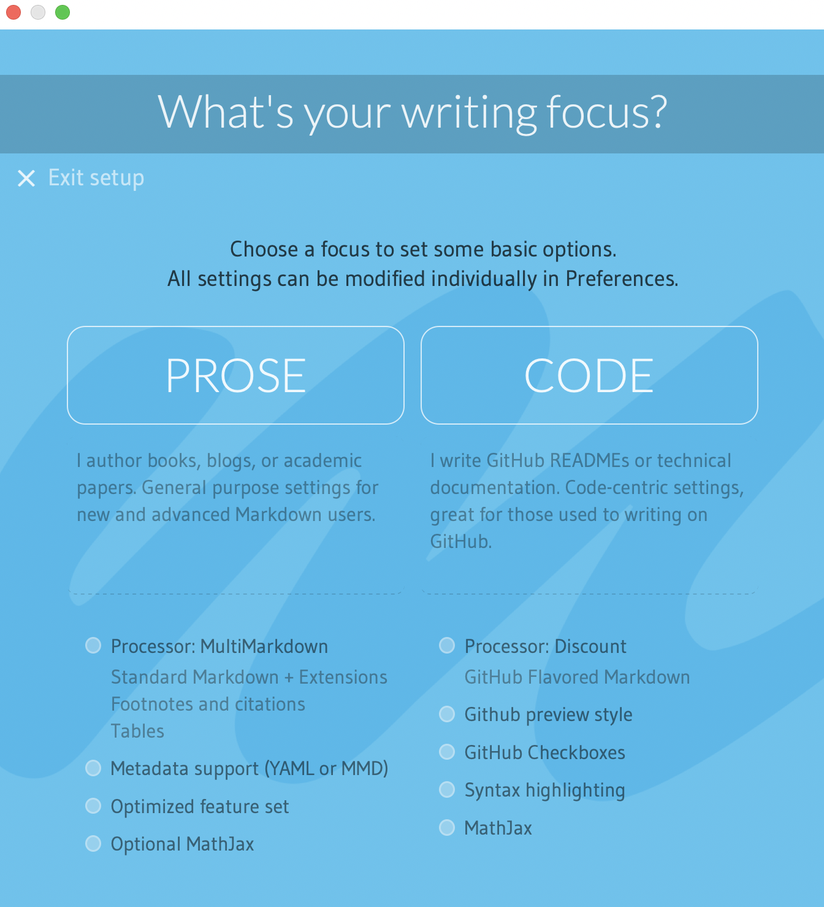

[Marked 2](https://marked2app.com/) is a proprietary Mac application that helps you preview (not edit) Markdown files on your Mac. The obvious use for this application is as a "missing desktop Markdown renderer" of sorts — just drag and drop a Markdown file on the Marked 2 icon and you'll see it rendered. One can imagine a teacher, for example, using this application to read and grade assignments that were submitted electronically as Markdown files. But there are numerous other uses for Marked 2. 

Consider that while many newer editors like Atom and [VS Code](vscode.md) have Markdown preview functionality built in, many older editors don't. Marked 2 is designed for people who use editors like Vim. You could arrange the Marked 2 window next to Vim for a live preview of what your rendered Markdown file will look like.

It's clear the author of this utility has invested a lot of time and effort to get things right. It's the attention to detail that makes this application worth the asking price. For instance, when you open Marked 2, a setup assistant guides you through configuring the rendering options to support your specific use case (Marked 2 actually contains two Markdown processors: MultiMarkdown and Discount). Highly recommended for Mac users that need a reliable way to preview or export Markdown files (check out the [available styles](https://marked2app.com/styles/)).

### Support for Additional Syntax Elements

As an added bonus, Marked 2 provides support for several obscure elements when using MultiMarkdown.

<table class="table table-bordered" style="font-size: 14px">
  <thead class="thead-light">
    <tr>
      <th>Element</th>
      <th>Markdown</th>
      <th>Rendered Output</th>
    </tr>
  </thead>
  <tbody>
    <tr>
      <td>Abbreviation</td>
      <td><code>*[HTML]: Hyper Text Markup Language</code> 
      <code>The HTML specification is maintained by the W3C.</code></td>
      <td>The <abbr title="Hyper Text Markup Language">HTML</abbr> specification is maintained by the W3C.</td>
    </tr>
    <tr>
      <td>Underline</td>
      <td><code>_word or phrase_</code></td>
      <td><ins>word or phrase</ins></td>
    </tr>
  </tbody>
</table>
