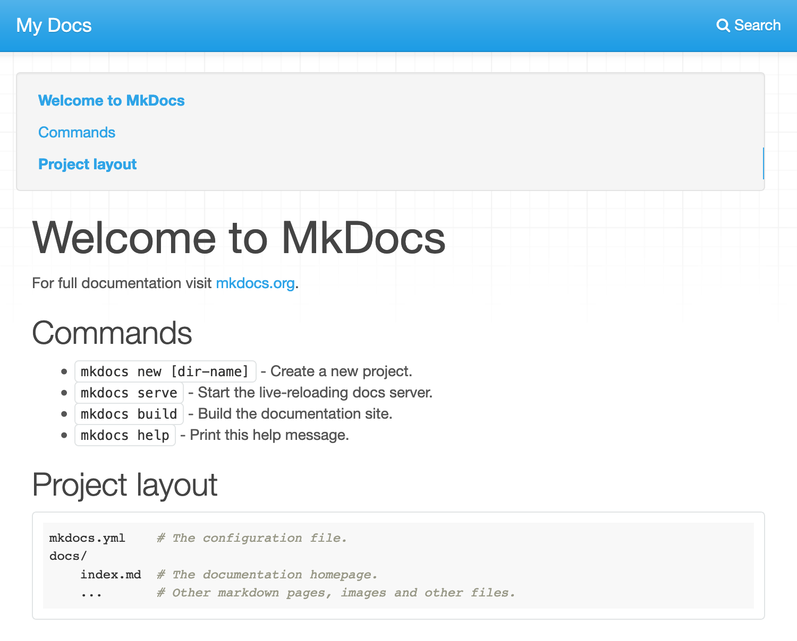

[MkDocs](https://www.mkdocs.org) is a static site generator designed for building documentation websites.  Written in the Python programming language, MkDocs is an open-source project with a lot of community support. A variety of [themes](https://github.com/mkdocs/mkdocs/wiki/MkDocs-Themes) are available. In terms of Markdown support, MkDocs does an excellent job supporting the basic syntax elements, but it lacks support for some extended syntax elements.

The application uses the [Python-Markdown](https://python-markdown.github.io/) Markdown processor. You can enable additional [extensions](https://www.mkdocs.org/user-guide/configuration/#markdown_extensions).



### Using Admonitions

Here's a handy feature: You can enable an extension to use [admonitions](https://python-markdown.github.io/extensions/admonition/) in MkDocs. This is a quick and easy way to start using notes, warnings, and tips on your MkDocs site. See this [GitHub issue](https://github.com/mkdocs/mkdocs/issues/1659) for more information and examples.
